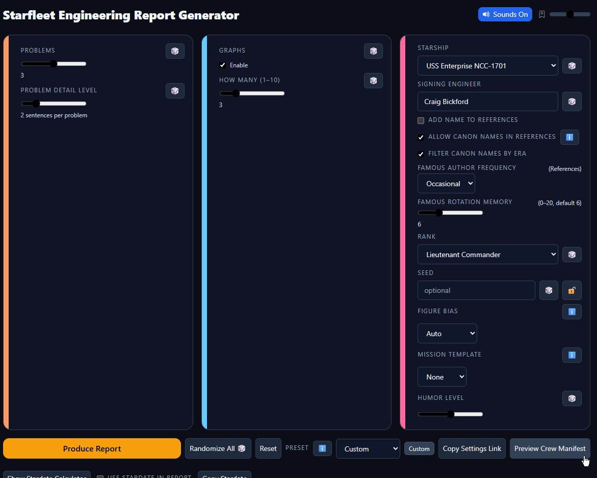

# Starfleet Engineering Report Generator

A Star Trek-themed engineering report generator with LCARS UI styling, designed to create authentic-looking Starfleet engineering reports with dynamic content, interactive charts, and sharing capabilities.

Live demo: https://rocketmobster.github.io/warpcorereports/

## Getting Started (1 minute)
- Open the Live Demo and click "Produce Report" to generate your first report.
- Try "Reroll Current Report" to get a fresh variant while keeping the same settings.
- Explore presets (Diagnostic/Incident/Maintenance/Performance) or pick a Mission Template (Incident/Survey) for focused content.
- Add your name/rank and optionally check "Add Name to References" to include the signer in References.
- Use the ℹ️ buttons in the UI for quick help on Templates, Figure Bias, Presets, Produce vs Reroll, and References.



## Recently Fixed

- Signing Engineer reference: When "Add Name to References" is checked, the References section now always includes a signing engineer entry and consistent numbering. See CHANGELOG 0.2.3.

## Features

- **LCARS-Style Interface**: Authentic Star Trek UI design with iconic colors and layout
- **Dynamic Report Generation**: Create unique engineering reports with randomized but coherent technical content
- **Interactive Charts**: Visualize system statuses with LCARS-style charts and diagrams
- **Crew Manifest Integration**: Include crew references in your reports
- **Multiple Export Formats**: Download reports as PDF, DOCX, or TXT
- **Sharing Capabilities**: Share reports via email or shareable links
- **Customization Options**: Control report length, detail level, and humor level
- **Seed-Based Generation**: Use seeds for reproducible reports
- **LCARS Sound Effects**: Authentic Star Trek computer sounds for UI interactions
- **Chart Editing**: Modify charts and visualizations with interactive editing tools
- **Footer**: LCARS-styled footer shows developer info, current app version, and a link to the GitHub repo. Version updates automatically on build.

## Quick Start
```bash
npm install
npm run dev
```
Open the URL shown in your terminal (usually http://localhost:5173).

## Building for Production
```bash
npm run build
npm run preview
```

## Usage Guide

### Basic Controls

1. **Vessel Selection**: Choose from classic Star Trek vessels
2. **Engineer Name**: Set the signing engineer's name and rank
3. **Problems Count**: Control how many engineering issues to include
4. **Detail Level**: Adjust the technical detail in each problem
5. **Graphs**: Toggle and control the number of data visualizations
6. **Generate Report**: Click "Produce Report" to create your report

### Produce vs Reroll

- **Produce Report**: Applies the controls above (problems, detail, graphs, vessel, signatory, humor, figure bias, signatory reference, and seed) to create a new report. If you enter or lock a seed, it will be used; otherwise a seed is generated for you.
- **Reroll Current Report**: Generates a new variation of the currently displayed report by creating a fresh seed (and stardate) while preserving the report’s existing settings (including Mission Template). Changes you make to the controls are NOT applied until you click Produce Report again.
- **What changes on Reroll**: Randomized content only — problem topics and summaries, chart data, references selection, and other generated flavor text.
- **What stays on Reroll**: The settings used to produce the currently displayed report — counts, detail level, graphs toggle/count, Mission Template, figure bias, vessel, signatory info, humor level, and signatory-reference choice.
- **Seed lock nuance**: Seed lock affects the Seed control for Produce Report. Reroll always uses a fresh seed regardless of the lock or what’s currently typed in the Seed field.

### Advanced Features

#### Reproducible Output
- Use the **Seed** field to get deterministic reports
- Same inputs + same seed = same report every time
- Lock the seed to maintain consistency across regenerations

#### Crew Manifest
- Click "Preview Crew Manifest" to see and edit crew members
- Crew members will be referenced in the report's content
- Regenerate random crew with the "Regenerate" button

#### Chart Editing
- Click "Edit Charts" to enter chart editing mode
- Hover over any chart and click the edit icon to modify it
- Change chart type, data values, titles, and other properties
- Changes are saved automatically when you exit edit mode

#### LCARS Sound Effects
- Toggle sounds on/off with the sound control in the header
- Adjust volume using the slider control
- Authentic LCARS UI sounds for button clicks, toggles, and notifications
- Sound preferences are saved between sessions

#### Chart Control
- **Figure Bias**: Choose from Auto, Warp, EPS, SIF, Deflector, Transporter, or Inertial to bias chart types
- Affects what kinds of systems are visualized in your reports

#### References & Canon Names
- **Add Name to References**: Guarantees the signing engineer is included in References.
- **Allow Canon Names in References**: Optionally include famous Star Trek names (curated for plausible ranks/titles).
- **Filter Canon Names by Era**: Limits canon names to those active during the vessel’s timeframe.
- **Famous Author Frequency**: How often famous canon names may appear: Off, Rare, Occasional, or Frequent. Humor and Mission Template can nudge frequency slightly.
- **Famous Rotation Memory**: Avoids reusing recently seen famous names (default 6; 0 disables rotation).
- **One-per-entry**: At most one famous author appears within a single reference entry.
- **Defaults**: Canon names allowed; era filter on; frequency "Occasional"; rotation memory 6.
- **Share keys**: Settings links encode these as `cn`, `ce`, `ff`, and `fm`.

### Presets vs Mission Templates vs Figure Bias

- **Presets**: One-click combinations that set numbers and toggles (problem count, detail level, graphs on/off and count, humor) and a default figure bias. You can tweak after selecting; the preset badge will show “Modified”.
- **Mission Templates**: Content bias without changing your numeric controls. Incident favors systems like Deflector, Shields, EPS, SIF, Transporters and nudges charts to status/impact (bar, gauge, step, etc.). Survey favors Sensors/Subspace/Bussard and nudges charts to trends/distributions (line, scatter, heatmap, pie, radar). Reroll keeps the chosen template. Settings links include the template. Phase 2: also biases header recipients (To/CC/Submitted To), narrative tone in Abstract/Conclusion, figure captions, and reference sources.
- **Figure Bias**: A global nudge for chart type selection (Warp/EPS/SIF/Deflector/etc.). If a Mission Template is set, its nudges apply first; figure bias further refines the choice. “Auto” lets the generator choose based on each problem’s system context.

### Sharing Your Report

#### Download Options
- **PDF**: High-quality formatted document with charts
- **DOCX**: Editable Word document format
- **TXT**: Plain text version for maximum compatibility

#### Share via Email
1. Click "Share Report" button
2. Select "Email" as the sharing method
3. Enter recipient's email address
4. Optionally select a file format to include
5. Click "Share Report" to open your email client

#### Share via Link
1. Click "Share Report" button
2. Select "Link" as the sharing method
3. Optionally select a file format
4. Click "Share Report" to generate and copy a link
5. Send the link to anyone you want to share with

## LCARS Sound Effects

The application includes authentic LCARS sound effects for a more immersive experience. To set up the sound files:

1. Start your development server:
```bash
npm run dev
```

2. Navigate to the sound generator tool in your browser:
```
http://localhost:5173/sound-generator.html
```

3. Use the interactive interface to preview the sounds and generate all sound files at once.

4. Download the generated MP3 files to your computer.

5. Move all the downloaded sound files to the `/public/sounds/` directory in your project.

6. Refresh your application - you should now hear authentic LCARS sounds when interacting with the UI!

You can customize the sound experience using the sound control panel in the application header.

## Repository Hygiene

The repository ignores accidental large artifacts and documents (e.g., screenshots, ZIP bundles, and large draft docs). If you need to share such assets, please attach them to releases rather than committing them to the repo.

## Randomize Controls

For quick exploration and fine-tuned randomness:

- "🎲" buttons appear beside many controls and will randomize just that field:
	- Problems, Problem Detail Level, Graphs On/Off, Graph Count, Starship, Signing Engineer, Rank, Seed, and Humor Level
- "Randomize All" randomizes all controls at once (respects the seed lock if enabled)
- Tooltips on each "🎲" button explain exactly what will be randomized

Tip: Lock the seed to keep results reproducible even when randomizing other controls.

## Stardate Calculator

- Toggle the panel below the main controls with "Show Stardate Calculator".
- Convert Calendar Date ↔ Stardate using common TOS/TNG-era approximations.
- Enable "Use Stardate in Report" to apply the calculator’s stardate to generated reports.
- When enabled, the current override value is shown inline next to the toggle.
 - Click the info icon to view the exact formulas used. Formulas are rendered with KaTeX for clarity, and you can copy them with the "Copy formulas" button.

## Browser Compatibility

- Chrome/Edge (Recommended)
- Firefox
- Safari
- Other modern browsers with ES6 support

## Privacy

All processing is done locally in your browser. No server backend is used for report generation, and no data is sent to external servers.

## Recent Fixes

- **Report Share Feature**: Fixed the error when generating DOCX files during report sharing. The application now properly generates DOCX files with charts, and falls back to a simplified version if chart rendering fails.
- **Report Regeneration**: Fixed an issue where regenerating reports or changing seeds didn't update the report content.
- **Footer**: Added LCARS-styled footer with developer info and auto-updating version.
- **Repo Cleanup**: Removed accidentally committed files (large PRD draft, screenshot, and ZIP bundle) and updated .gitignore to prevent future occurrences.

## Roadmap

Upcoming features and improvements planned for future versions:

### Short-term (v0.3.0)
- Add support for more starship classes with class-specific report templates
- Implement tabbed interface for viewing multiple reports simultaneously
- Add export to HTML format with interactive elements
- Enhance chart editing with more visualization options

### Medium-term (v0.4.0-v0.5.0)
- Create save/load functionality for reports
- Add custom section support for user-defined content
- Implement report templates system
- Add animation effects for LCARS interface elements

### Long-term (v1.0.0+)
- Server-side storage for shared reports to avoid URL length limitations
- Authentication system for accessing shared reports
- Support for embedding reports in other applications
- Mobile-responsive design for tablet and phone use
- Customizable sound themes for different starship classes

---

"Live long and prosper! 🖖"
